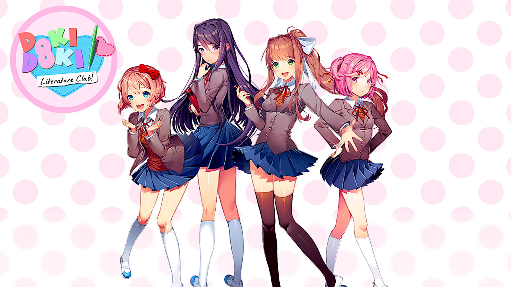

<h1>Doki Doki Literature Club For Web Browsers</h1>

The popular anime visual novel DDLC programmed from zero in vanilla javascript, in order to make it playable in a web browser. It was my first big proyect, I started it when I had few notions of web development, so it's full of errors and terrible practices, but I managed to build the entire game and make it run exactly like the original with very few tools.

Some of the many concepts I handle in this project are:

    CSS animations
    Responsive Design
    POO
    Consuming data from API
    Audio Handling 
    Image storage

<h2><b>Notes:</h2> This is a fork from elRomanoff's dokidoki webport github, what I'm trying to achieve here is to complete the port completely, since Romanoff left it at day 4.
While also, there might be another fork of the current repository (after I have completed the whole port) where I'm gonna try to "port" it into a web version without the need of a host.
I can't promise anything, but it's there.</b>
